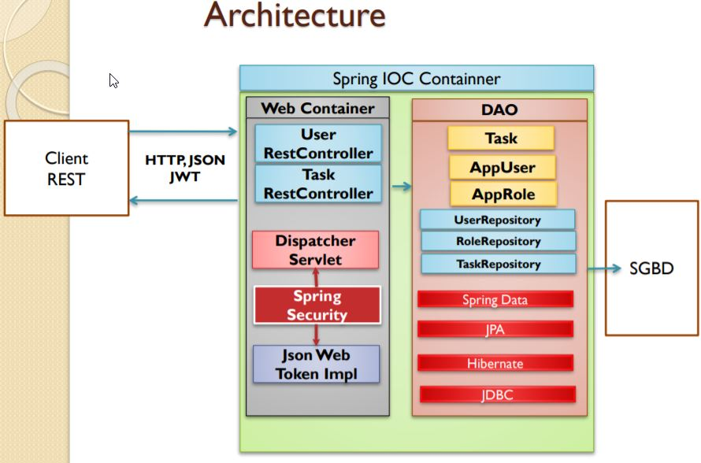

#  Spring Security et JWT

https://bezkoder.com/spring-boot-jwt-authentication/
https://blog.ippon.fr/2017/10/12/preuve-dauthentification-avec-jwt/
https://grobmeier.solutions/spring-security-5-jwt-basic-auth.html
https://dzone.com/articles/spring-boot-security-json-web-tokenjwt-hello-world
http://www.programmersought.com/article/98611073523/
https://blog.invivoo.com/securiser-application-spring-boot-spring-security/

https://octoperf.com/blog/2018/03/08/securing-rest-api-spring-security/
https://programming.vip/docs/spring-security-dynamic-url-permission-control.html


##architecture



## diagrame de séquence authentification avec JWT


## diagrame de séquence de demande de ressource


##  Besoin Créer une application qui permet de gérer des tâches.
- L’accès à l’API REST est sécurisé d’une manière **statless**, par Spring security en utilisant **Json Web Token**


## Création projet spring


La dependance maven **spring-boot-starter-data-rest** va automatique exposer toutes les methodes par defaut sans meme avoir mis l'annotatoin **@@RepositoryRestResource**


*par defaut spring securité utilise les **JSESSIONID** stocké dans un **cookie** coté borwser.


par defaut la configuration de spring securité est de type **statefull** ( gestion par **JSESSIONS**. Une gestion du token coté server). Spring securité s'attend à recevoir le synchonized ID CSRFID (qu'il à generé initialement et envoyé au client via un formulaire ) pour toutes requetes de type **POST,PUT,PATCH** emisent par le client. Ceci arrive lorqu'on utilise par exemple POSTMAN ou il n'a pas eu au préalable une authentification via un formulaire contenant un attribut hidden **_csrf**. 


Pour faire du **stateless** Il faut pour cele  déactivé le csrf par défaut coté spring security

````java
http.csrf().disabel()
```` 

 
----------------------------------------------------------------


